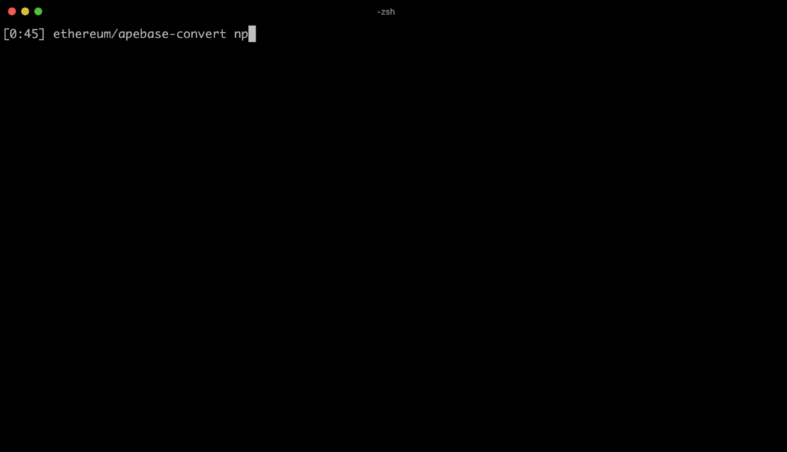
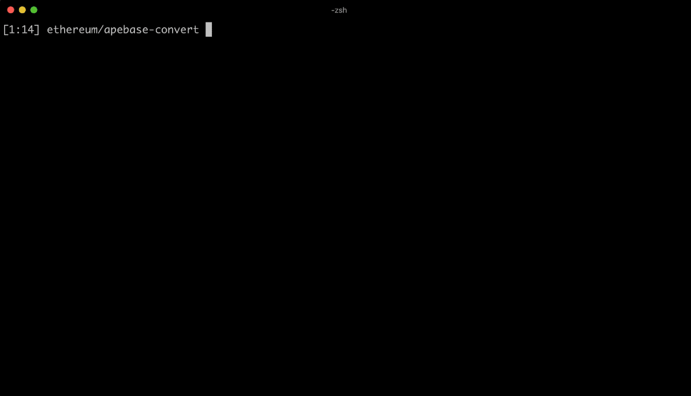

# NFTP

The simplest way to publish files and folders to IPFS, with one command.

100% FREE to upload as much files as you want, powered by [nft.storage](https://nft.storage).



---

# Install

```
npm install -g nftp
```

# Usage

```
nftp <path>
```

Currently NFTP supports two types of uploads:

1. **File upload:** specify the file path
2. **Folder upload:** specify the path to the folder. (NOTE: NFTP currently does NOT support nested folders, only supports a folder made up of files)

# Authentication

The first time you run the command it will ask you for the **NFT.STORAGE API KEY**. You can get it over here: https://nft.storage/



---

# Examples

For example if you want to publish all files at current path, simply run:

```
nftp .
```

To publish a specific file named `package.json`

```
nftp package.json
```

Supports absolute paths:

```
nftp /etc
```

And supports relative paths:

```
nftp ../images
```

---

# FAQ

1. **Is it free?:** Yes it's 100% FREE, powered by [nft.storage](https://nft.storage). NFTP is simply a program that lets you upload easily to IPFS using nft.storage
2. **Where is my nft.storage API key stored?:** It is stored under `~/.nftstorage` (a hidden file named `.nftstorage` at your home path)
3. **How do I refresh my nft.storage API key?:** Simply delete the `~/.nftstorage` file and run the `nftp` command again and it will ask you for a new API key. 
